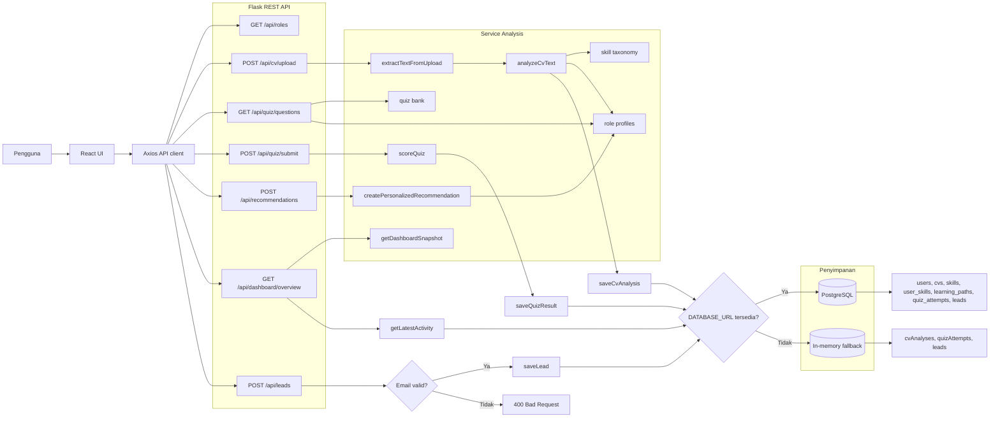

# Flowchart Aplikasi SkillMap

Dokumen ini merangkum alur aplikasi SkillMap berdasarkan implementasi frontend React, Flask API, service analisis, repository penyimpanan, data dashboard, dan rencana proyek capstone CC26-PSU401.

## Alur Utama Pengguna

```mermaid
flowchart TD
  A([Mulai]) --> B[Buka aplikasi web SkillMap]
  B --> C[Frontend memuat data awal]

  C --> C1[GET /api/roles]
  C --> C2[GET /api/dashboard/overview]
  C --> C3[GET /api/project/requirements]

  C1 --> D[Pilih target role]
  C2 --> D
  C3 --> D

  D --> E[Isi biodata ala JobStreet]
  E --> E0{Semua biodata terisi?}
  E0 -->|Tidak| E
  E0 -->|Ya| E1[Nama, domisili, pendidikan, posisi diminati, pengalaman]
  E1 --> F{Upload CV PDF?}

  F -->|Ya| G[Unggah file CV PDF]
  F -->|Tidak| F
  G --> H[Isi ringkasan profil wajib]

  H --> I
  I{CV PDF dan ringkasan lengkap?} -->|Tidak| H
  I -->|Ya| I1[POST /api/cv/upload]

  I1 --> J[API validasi format PDF]
  J --> J1[Ekstrak PDF menjadi teks]
  J1 --> J2[Tampilkan teks PDF yang dibaca AI]
  J2 --> K[Deteksi skill dari taxonomy]
  K --> L[Bandingkan skill dengan target role]
  L --> M[Hitung readiness score dan confidence]
  M --> N[Buat skill gap, rekomendasi, dan roadmap]
  N --> O[Simpan analisis CV]
  O --> P[Tampilkan skill terdeteksi dan gap prioritas]

  P --> P1[Tampilkan rekomendasi pekerjaan berdasarkan persentase kecocokan]
  P1 --> Q[Mini quiz YES/NO]
  Q --> Q1{Contoh: pandai mengatur waktu?}
  Q1 -->|YES| R[Tampilkan rekomendasi karier]
  Q1 -->|NO| S[Tampilkan pilihan belajar dari e-course platform]
  R --> U[POST /api/recommendations]
  S --> U
  U --> V[Gabungkan hasil CV, job match, dan jawaban mini quiz]
  V --> W[Perbarui rekomendasi akhir]

  W --> X[Dashboard menampilkan skor, kekuatan, gap, sinyal industri, roadmap, dan aktivitas]
  X --> Y{Simpan perjalanan belajar?}

  Y -->|Ya| Z[Masukkan email]
  Z --> AA[POST /api/leads]
  AA --> AB{Email valid?}
  AB -->|Ya| AC[Simpan lead]
  AB -->|Tidak| AD[Tampilkan pesan error]

  Y -->|Tidak| AE([Selesai])
  AC --> AE
  AD --> X
```

## Alur Backend dan Data

## Ringkasan Input, Proses, Output

| Tahap | Input | Proses | Output |
| --- | --- | --- | --- |
| Load awal | Halaman web dibuka | Ambil role, snapshot dashboard, dan requirement proyek | Data role, modul capstone, data dashboard |
| Biodata | Nama, domisili, pendidikan, posisi diminati, pengalaman | Validasi semua field wajib sebelum lanjut | Profil pelamar terstruktur |
| Analisis CV | File CV PDF, ringkasan profil, biodata, domain, target role | Validasi input wajib, validasi PDF, ekstraksi teks PDF, deteksi skill, mapping ke required skills | Teks PDF yang dibaca AI, extracted skills, skill gap, readiness score, job match percentage |
| Mini quiz | Jawaban YES/NO pengguna | Cabang keputusan berdasarkan sinyal kesiapan personal | YES: rekomendasi karier, NO: pilihan e-course |
| Rekomendasi | Skill hasil CV, job match, jawaban mini quiz | Gabungkan sinyal CV dan kuis untuk rekomendasi akhir | Readiness score final, skill gap, roadmap belajar, career/course recommendation |
| Dashboard | Snapshot, hasil analisis, hasil kuis, activity | Render insight personal dan aktivitas demo | Skor, kekuatan, gap, roadmap, activity |
| Lead capture | Email dan target role | Validasi email lalu simpan | Lead tersimpan atau pesan error |

## Catatan Sumber Implementasi

- Frontend: `apps/web/src/App.jsx`
- API client: `apps/web/src/api.js`
- Flask API: `apps/api/src/app.py`
- Logic analisis: `apps/api/src/services/analysis.js`
- Repository penyimpanan: `apps/api/src/repositories/store.js`
- Data snapshot: `apps/api/src/data/dashboardSnapshot.json`
- Skema database: `database/schema.sql`
