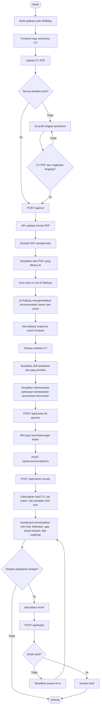
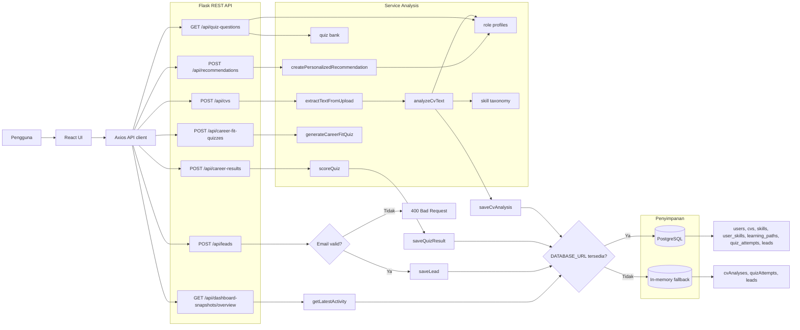

# Alur Aplikasi SkillMap

Dokumen ini menjelaskan alur aplikasi SkillMap berdasarkan implementasi frontend React, Flask API, service analisis, repository penyimpanan, data dashboard, dan rencana proyek capstone CC26-PSU401.

## Alur Utama Pengguna

## Alur Backend dan Data

## Ringkasan Input, Proses, Output

| Tahap | Input | Proses | Output |
|-------|-------|--------|--------|
| Load awal | Halaman web dibuka | Siapkan state aplikasi dan sesi auth jika tersedia | Aplikasi siap menerima CV |
| Profil singkat | Posisi yang dituju, skill/pengalaman tambahan, profil singkat | Validasi semua field wajib sebelum lanjut | Konteks pelengkap CV |
| Analisis CV | File CV PDF, ringkasan profil, biodata, domain, target role | Validasi input, ekstraksi teks PDF, deteksi skill, mapping ke required skills | Teks PDF yang dibaca AI, extracted skills, skill gap, readiness score, job match percentage |
| Mini quiz | Pilihan pengguna dari beberapa opsi role | Validasi kecenderungan karier dari job match | Role yang paling kuat dari CV dan minat pengguna |
| Rekomendasi | Skill hasil CV, job match, jawaban mini quiz | Gabungkan sinyal CV dan quiz untuk rekomendasi akhir | Readiness score final, skill gap, roadmap belajar, career/course recommendation |
| Dashboard | Hasil analisis, hasil quiz, rekomendasi akhir | Render insight personal | Role final, kekuatan, gap, roadmap |
| Lead capture | Email dan target role | Validasi email lalu simpan | Lead tersimpan atau pesan error |

## Referensi Implementasi

| Komponen | Lokasi |
|----------|--------|
| Frontend | `apps/web/src/App.jsx` |
| API client | `apps/web/src/api.js` |
| Flask API | `../BE-Capstone/src/app.py` |
| Logic analisis | `../BE-Capstone/src/services/analysis.py` |
| Repository penyimpanan | `../BE-Capstone/src/repositories/store.py` |
| Skema database | `../BE-Capstone/database/schema.sql` |
